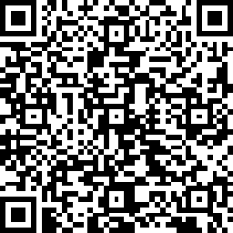

# Content

[1 - Description](#description)

[2 - IDE](#ide)

[3 - Objective](#objective)

[4 - Overview](#overview)

[5 - Composition](#composition)

[6 - Run](#run)

[7 - Requirements](#requirements)

[8 - Usage](#usage)

[9 - References](#references)

[10 - Contact](#contact)

[11 - Forthcoming Work](#forthcoming-work)

[12 - Preview](#preview)

[13 - Buy me a coffee](#buy-me-a-coffee-)

# Description

-   IMDB News APP

# IDE

- Android Studio 3.5 Beta 5
- Build #AI-191.7479.19.35.5675373, built on June 20, 2019
- JRE: 1.8.0_202-release-1483-b49-5587405 x86_64
- JVM: OpenJDK 64-Bit Server VM by JetBrains s.r.o
- macOS 10.14.5

# Objective

  - List latest movies from IMDB API 

# Overview

  - N/A

# Composition

  - kotlin_version 1.3.41
  - paging_runtime_version 2.1.0-rc01
  - lifecycle_version 2.2.0-alpha02
  - converter_gson_version 2.6.0
  - retrofit_version 2.6.1
  - fresco_version 1.13.0
  - lottie_version 3.0.7
  - interceptor_version 4.0.1
  - espresso_core_version 3.2.0
  - junit_version 4.12
  - andx_junit_version 1.1.1
  - appcompat_version 1.0.2
  - constraint_version 1.1.3
  - mockito_core_version 2.28.2
  - andx_core_testing_version 2.0.1
  - detekt_version = '1.0.0'

# Run

  -  Clone this repository and open build.gradle with Android Studio
  -  `./gradlew monits` to run static code analysers

# Requirements

  - minSdkVersion 24
  - targetSdkVersion 29

# Usage

  - N/A 

#   References

  - N/A

#   Contact

  - roliveira.victor@gmail.com

#   Forthcoming Work

  - N/A

#   Preview

#   Buy me a coffee ;)

